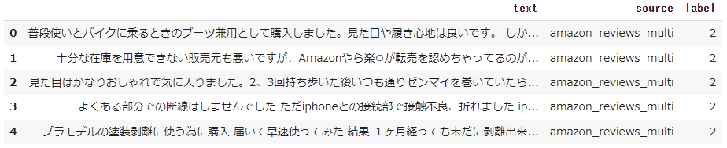
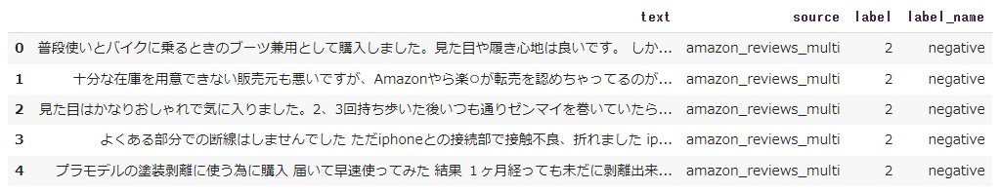
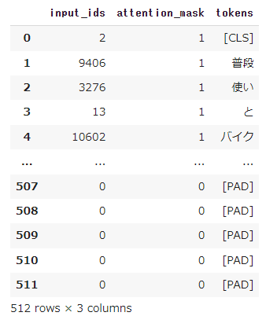
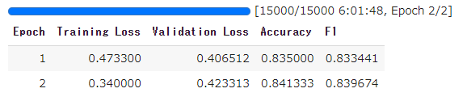
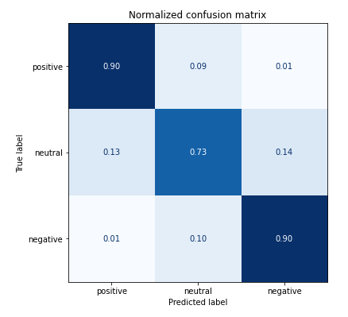

こんちには。

データアナリティクス事業本部 機械学習チームの中村です。

最近以下の書籍を読んでいます。

- [機械学習エンジニアのためのTransformers](https://www.oreilly.co.jp/books/9784873119953/)

Hugging Faceにおけるライブラリ（Transformersなど）の使用方法について、ライブラリの作者自身が解説した本となっています。
様々なタスクにおける、Hugging Faceのライブラリの使用方法の他、Transformerの進化の歴史や、TransformerのアーキテクチャをゼロからPyTochで実装する部分箇所もあり、
結構濃い内容でオススメです。

書籍の内容を第4章まで読み終え、読んだ内容を日本語タスクでも試してみたいということで、

本記事では日本語を題材にした、テキスト分類の１つである感情分析をやってみたいと思います。

## Hugging Faceの概要

Hugging Faceは主に自然言語処理を扱えるエコシステム全体を提供しています。

実際に使用する際は以下のようなフローで進めていきます。

WIP図挿入

各箇所で必要な処理があらかじめライブラリとしてtransformersやdatasetsという名前で提供されています。

またデータセットやモデル(トークナイザ)もHugging Faceのページで検索して必要なものを見つけることが可能です。

今回もこの手順に沿って進めていきます。

## やってみた

### 実行環境

今回はGoogle Colaboratory環境で実行しました。

ハードウェアなどの情報は以下の通りです。

- GPU: Tesla P100 (GPUメモリ16GB搭載)
- CUDA: 11.1
- メモリ: 26GB

主なライブラリのバージョンは以下となります。

- transformers: 4.22.1
- datasets: 2.4.0

### インストール

transformersとdatasetsをインストールします。

[code]
!pip install transformers
!pip install datasets
[/code]

### データセットの検索

使用するデータセットをまず探す必要があります。

データセットはHugging Faceのページに準備されており、以下から検索が可能です。

- [https://huggingface.co/datasets](https://huggingface.co/datasets)

今回は以下のデータセットのうち、日本語のサブセットを使用します。

- [https://huggingface.co/datasets/tyqiangz/multilingual-sentiments](https://huggingface.co/datasets/tyqiangz/multilingual-sentiments)

### データセットの取得

以下を実行しデータセットを取得します。

[code lang="python"]
from datasets import load_dataset

dataset = load_dataset("tyqiangz/multilingual-sentiments", "japanese")
[/code]

### データセットの確認

取得したデータセットの中身を見てみましょう。

[code lang="python"]
dataset
[/code]

[code]
DatasetDict({
    train: Dataset({
        features: ['text', 'source', 'label'],
        num_rows: 120000
    })
    validation: Dataset({
        features: ['text', 'source', 'label'],
        num_rows: 3000
    })
    test: Dataset({
        features: ['text', 'source', 'label'],
        num_rows: 3000
    })
})
[/code]

データセットは以下のようにtrain, validation, testに分かれています。

それぞれが、['text', 'source', 'label']といった情報を持っていることも分かります。

以下のようにフォーマットを設定することで、データフレームとして扱うことも可能です。

[code lang="python"]
dataset.set_format(type="pandas")
train_df = dataset["train"][:]
train_df.head(5)
[/code]

データを理解する上では、データフレームで扱える部分は便利ですね。

'source'と'label'の内訳を見てみましょう。

[code lang="python"]
train_df.value_counts(["source", "label"])
[/code]

[code]
source                label
amazon_reviews_multi  0        40000
                      1        40000
                      2        40000
dtype: int64
[/code]

'source'は一つの値しか取らず、'label'は3種類であることが分かります。

各カテゴリは何を意味については、featuresを見れば分かるようになっています。

featuresは、各列の値についての詳細が記載してあります。

[code lang="python"]
dataset["train"].features
[/code]

[code]
{'text': Value(dtype='string', id=None),
 'source': Value(dtype='string', id=None),
 'label': ClassLabel(num_classes=3, names=['positive', 'neutral', 'negative'], id=None)}
[/code]

このように、labelはClassLabelクラスとなっており、0,1,2が'positive','neutral','negative'に割り当てられていることが分かります。

ClassLabelクラスには、int2strというメソッドがあり、これでラベル名に変換することが可能です。

[code lang="python"]
def label_int2str(x):
	return dataset["train"].features["label"].int2str(x)

train_df["label_name"] = train_df["label"].apply(label_int2str)
train_df.head()
[/code]

最後に、データフレームにしていたフォーマットを元に戻します。

[code lang="python"]
dataset.reset_format()
[/code]

### モデルの検索

データをトークナイザで処理する前に、使用する事前学習モデルを決める必要があります。

モデルもHugging Faceのページに準備されており、以下から検索が可能です。

- [https://huggingface.co/models](https://huggingface.co/models)

この中で、BERTの日本語版を探し、その中が比較的ダウンロード数の多い以下を使用することにします。

- [https://huggingface.co/cl-tohoku/bert-base-japanese-whole-word-masking](https://huggingface.co/cl-tohoku/bert-base-japanese-whole-word-masking)

他にも様々な事前学習モデルがありますが、後述するトークナイザの精度などを確認し、問題が無さそうなものを選択しました。

### トークナイザの動作確認

トークナイザ利用前に以降でライブラリが不足しているというエラーが出るため、以下をインストールしました。

[code]
!pip install fugashi
!pip install ipadic
[/code]

その後、トークナイザを`AutoTokenizer`で呼び出します。

[code lang="python"]
from transformers import AutoTokenizer

model_ckpt = "cl-tohoku/bert-base-japanese-whole-word-masking"
tokenizer = AutoTokenizer.from_pretrained(model_ckpt)
[/code]

トークナイザを動かしてみましょう。

とりあえずサンプルのテキストを自身の過去のブログ記事から拝借してきました。

[code]
sample_text = "\
機械学習のコア部分のロジックを、定型的な実装部分から切り離して\
定義できるようなインターフェースに工夫されています。 \
そのためユーザーは、機械学習のコア部分のロジックの検討に\
集中することができます。\
"
[/code]

トークナイザの結果は以下で得られます。

[code lang="python"]
sample_text_encoded = tokenizer(sample_text)
print(sample_text_encoded)
[/code]

[code]
{'input_ids': [2, 2943, 4293, 5, 6759, 972, 5, 138, 17394, 11, 6, 23398, 81, 18, 6561, 
972, 40, 24547, 16, 2279, 392, 124, 18, 23953, 7, 9909, 26, 20, 16, 21, 2610, 8, 59, 
82, 4502, 9, 6, 2943, 4293, 5, 6759, 972, 5, 138, 17394, 5, 3249, 7, 4155, 34, 45, 14, 
203, 2610, 8, 3], 'token_type_ids': [0, 0, 0, 0, 0, 0, 0, 0, 0, 0, 0, 0, 0, 0, 0, 0, 
0, 0, 0, 0, 0, 0, 0, 0, 0, 0, 0, 0, 0, 0, 0, 0, 0, 0, 0, 0, 0, 0, 0, 0, 0, 0, 0, 0, 0, 
0, 0, 0, 0, 0, 0, 0, 0, 0, 0, 0], 'attention_mask': [1, 1, 1, 1, 1, 1, 1, 1, 1, 1, 1, 
1, 1, 1, 1, 1, 1, 1, 1, 1, 1, 1, 1, 1, 1, 1, 1, 1, 1, 1, 1, 1, 1, 1, 1, 1, 1, 1, 1, 1, 
1, 1, 1, 1, 1, 1, 1, 1, 1, 1, 1, 1, 1, 1, 1, 1]}
[/code]

結果はこのように、`input_ids`と`attention_mask`が含まれます。

`input_ids`は数字にエンコードされたトークンで、`attention_mask`は後段のモデルで有効なトークンかどうかを判別するためのマスクです。

無効なトークン（例えば、`[PAD]`など）に対しては、`attention_mask`を0として処理します。

トークナイザの結果は数字にエンコードされているため、トークン文字列を得るには、`convert_ids_to_tokens`を用います。

[code lang="python"]
tokens = tokenizer.convert_ids_to_tokens(sample_text_encoded.input_ids)
print(tokens)
[/code]

[code]
['[CLS]', '機械', '学習', 'の', 'コア', '部分', 'の', 'ロ', '##ジック', 'を', '、', 
'定型', '的', 'な', '実装', '部分', 'から', '切り離し', 'て', '定義', 'できる', 
'よう', 'な', 'インターフェース', 'に', '工夫', 'さ', 'れ', 'て', 'い', 'ます', '。',
 'その', 'ため', 'ユーザー', 'は', '、', '機械', '学習', 'の', 'コア', '部分', 'の', 
 'ロ', '##ジック', 'の', '検討', 'に', '集中', 'する', 'こと', 'が', 'でき', 'ます', 
 '。', '[SEP]']
[/code]

結果がこのように得られます。

先頭に`##`が付加されているものは、サブワード分割されているものです。

また、系列の開始が`[CLS]`、系列の終了(実際は複数系列の切れ目)が`[SEP]`という特殊なトークンとなっています。

トークナイザについては以下にも説明があります。

- [https://huggingface.co/cl-tohoku/bert-base-japanese-whole-word-masking](https://huggingface.co/cl-tohoku/bert-base-japanese-whole-word-masking)

> The texts are first tokenized by MeCab morphological parser with the IPA dictionary and then split into subwords by the WordPiece algorithm. The vocabulary size is 32000.

トークン化にIPA辞書を使ったMecabが使用され、サブワード分割にはWordPieceアルゴリズムが使われているようです。

その他、文字列を再構成するには、`convert_tokens_to_string`を用います。

[code lang="python"]
decode_text = tokenizer.convert_tokens_to_string(tokens)
print(decode_text)
[/code]

[code]
[CLS] 機械 学習 の コア 部分 の ロジック を 、 定型 的 な 実装 部分 から 切り離し て 
定義 できる よう な インターフェース に 工夫 さ れ て い ます 。 その ため ユーザー 
は 、 機械 学習 の コア 部分 の ロジック の 検討 に 集中 する こと が でき ます 。 
[SEP]
[/code]

### データセット全体のトークン化

データセット全体に処理を適用するには、バッチ単位で処理する関数を定義し、mapを使って実施します。

- `padding=True`でバッチ内の最も長い系列長に合うようpaddingする処理を有効にします。
- `truncation=True`で、後段のモデルが対応する最大コンテキストサイズ以上を切り捨てます。

[code lang="python"]
def tokenize(batch):
    return tokenizer(batch["text"], padding=True, truncation=True)
[/code]

モデルが対応する最大コンテキストサイズは、以下で確認ができます。

[code lang="python"]
tokenizer.model_max_length
[/code]

[code]
512
[/code]

これをデータセット全体に適用します。

- `batched=True`によりバッチ化され、`batch_size=None`により全体が1バッチとなります。

[code lang="python"]
dataset_encoded = dataset.map(tokenize, batched=True, batch_size=None)
[/code]

結果を以下で確認します。

[code lang="python"]
dataset_encoded
[/code]

[code]
DatasetDict({
    train: Dataset({
        features: ['text', 'source', 'label', 'input_ids', 'token_type_ids', 'attention_mask'],
        num_rows: 120000
    })
    validation: Dataset({
        features: ['text', 'source', 'label', 'input_ids', 'token_type_ids', 'attention_mask'],
        num_rows: 3000
    })
    test: Dataset({
        features: ['text', 'source', 'label', 'input_ids', 'token_type_ids', 'attention_mask'],
        num_rows: 3000
    })
})
[/code]

これだけで、データセット全体に適用され、カラムが追加されていることが分かります。

token_types_idは今回は使用しませんが、複数の系列がある場合に使用されます。(詳細は下記を参照)

- [https://huggingface.co/docs/transformers/glossary#token-type-ids](https://huggingface.co/docs/transformers/glossary#token-type-ids)

サンプル単位で結果を確認したい場合は、データフレームなどを使用します。

[code lang="python"]
import pandas as pd
sample_encoded = dataset_encoded["train"][0]
pd.DataFrame(
    [sample_encoded["input_ids"]
     , sample_encoded["attention_mask"]
     , tokenizer.convert_ids_to_tokens(sample_encoded["input_ids"])],
    ['input_ids', 'attention_mask', "tokens"]
).T
[/code]

### 分類器の実現方法

テキスト分類のためにはここから、BERTモデルの後段に分類用のヘッドを接続する必要があります。

WIP図

接続後、テキスト分類を学習する方法に大きく２種類あります。

- 接続した分類用ヘッドのみを学習
- BERTを含むモデル全体を学習(fine-tuning)

前者は高速な学習が可能でGPUなどが利用できない場合に選択肢になり、後者の方がよりタスクに特化できるので高精度となります。

本記事では後者のfine-tuningする方法で実装していきます。

### 分類器の実装

今回のようなテキストを系列単位で分類するタスクには、既にそれ専用のクラスが準備されており、以下で構築が可能です。

[code lang="python"]
import torch
from transformers import AutoModelForSequenceClassification

device = torch.device("cuda" if torch.cuda.is_available() else "cpu")
num_labels = 3

model = (AutoModelForSequenceClassification
    .from_pretrained(model_ckpt, num_labels=num_labels)
    .to(device))
[/code]

### トレーニングの準備

学習時に性能指標を与える必要があるため、それを関数化して定義しておきます。

[code lang="python"]
from sklearn.metrics import accuracy_score, f1_score

def compute_metrics(pred):
    labels = pred.label_ids
    preds = pred.predictions.argmax(-1)
    f1 = f1_score(labels, preds, average="weighted")
    acc = accuracy_score(labels, preds)
    return {"accuracy": acc, "f1": f1}
[/code]

こちらはEvalPredictionオブジェクトをうけとる形で実装します。

EvalPredicitonオブジェクトは、predictionsとlabel_idsという属性を持つnamed_tupleです。

そして学習用のパラメータを`TrainingArguments`クラスを用いて設定します。

[code lang="python"]
from transformers import TrainingArguments

batch_size = 16
logging_steps = len(dataset_encoded["train"]) // batch_size
model_name = "sample-text-classification-bert"

training_args = TrainingArguments(
    output_dir=model_name,
    num_train_epochs=2,
    learning_rate=2e-5,
    per_device_train_batch_size=batch_size,
    per_device_eval_batch_size=batch_size,
    weight_decay=0.01,
    evaluation_strategy="epoch",
    disable_tqdm=False,
    logging_steps=logging_steps,
    push_to_hub=False,
    log_level="error"
)
[/code]

### トレーニングの実行

トレーニングは、Trainerで実行します。

[code lang="python"]
from transformers import Trainer

trainer = Trainer(
    model=model,
    args=training_args,
    compute_metrics=compute_metrics,
    train_dataset=dataset_encoded["train"],
    eval_dataset=dataset_encoded["validation"],
    tokenizer=tokenizer
)
trainer.train()
[/code]

[code]
TrainOutput(global_step=15000, training_loss=0.406665673828125, 
metrics={'train_runtime': 21710.6766, 'train_samples_per_second': 11.054, 
'train_steps_per_second': 0.691, 'total_flos': 6.314722025472e+16, 
'train_loss': 0.406665673828125, 'epoch': 2.0})
[/code]

今回は、学習に6時間程度かかりました。

### 推論テスト

推論結果はpredictにより得ることができます。

[code lang="python"]
preds_output = trainer.predict(dataset_encoded["validation"])
[/code]

これを混同行列で可視化してみます。

[code lang="python"]
import numpy as np
import matplotlib.pyplot as plt
from sklearn.metrics import ConfusionMatrixDisplay, confusion_matrix

y_preds = np.argmax(preds_output.predictions, axis=1)
y_valid = np.array(dataset_encoded["validation"]["label"])
labels = dataset_encoded["train"].features["label"].names

def plot_confusion_matrix(y_preds, y_true, labels):
    cm = confusion_matrix(y_true, y_preds, normalize="true")
    fig, ax = plt.subplots(figsize=(6, 6))
    disp = ConfusionMatrixDisplay(confusion_matrix=cm, display_labels=labels)
    disp.plot(cmap="Blues", values_format=".2f", ax=ax, colorbar=False)
    plt.title("Normalized confusion matrix")
    plt.show()

plot_confusion_matrix(y_preds, y_valid, labels)
[/code]

結果についてWIP

### モデル保存

保存前にラベル情報を与えてあげます。

(実際は、`TrainingArguments`で与えた方が便利なようです)

[code lang="python"]
id2label = {}
for i in range(dataset["train"].features["label"].num_classes):
    id2label[i] = dataset["train"].features["label"].int2str(i)

label2id = {}
for i in range(dataset["train"].features["label"].num_classes):
    label2id[dataset["train"].features["label"].int2str(i)] = i

trainer.model.config.id2label = id2label
trainer.model.config.label2id = label2id
[/code]

保存先として、Goole DriveをあらかじめColabにマウントしておきます。

そして、`save_model`で保存します。

[code lang="python"]
trainer.save_model(f"/content/drive/MyDrive/sample-text-classification-bert")
[/code]

保存結果WIP

### ロードして推論

きちんと保存されているかテストします。

以下でPyTorchモデルとしてロードされます。

[code lang="python"]
new_tokenizer = AutoTokenizer\
    .from_pretrained(f"/content/drive/MyDrive/sample-text-classification-bert")

new_model = (AutoModelForSequenceClassification
    .from_pretrained(f"/content/drive/MyDrive/sample-text-classification-bert")
    .to(device))
[/code]

サンプルテキストを推論します。

[code lang="python"]

inputs = new_tokenizer(sample_text, return_tensors="pt")

new_model.eval()

with torch.no_grad():
    outputs = new_model(
        inputs["input_ids"].to(device), 
        inputs["attention_mask"].to(device),
    )
outputs.logits
[/code]

[code]
tensor([[ 1.7906,  1.3553, -3.2282]], device='cuda:0')
[/code]

logitsを推論ラベルに変換します。

[code lang="python"]
y_preds = np.argmax(outputs.logits.to('cpu').detach().numpy().copy(), axis=1)
def id2label(x):
    return new_model.config.id2label[x]
y_dash = [id2label(x) for x in y_preds]
y_dash
[/code]

[code]
['positive']
[/code]

## コードまとめ

ここまで色々とコードを書いてきましたが、以下にまとめを書いておきます。

- インストール

[code lang="python"]
!pip install transformers
!pip install datasets
!pip install fugashi # tokenizerが内部で使用
!pip install ipadic # tokenizerが内部で使用
[/code]

- コード

[code lang="python"]
from datasets import load_dataset
from transformers import AutoModelForSequenceClassification, AutoTokenizer
from transformers import TrainingArguments
from transformers import Trainer
from sklearn.metrics import accuracy_score, f1_score
from sklearn.metrics import ConfusionMatrixDisplay, confusion_matrix
import torch
import matplotlib.pyplot as plt
import numpy as np

# データセット取得
dataset = load_dataset("tyqiangz/multilingual-sentiments", "japanese")

# トークナイザの取得
tokenizer = AutoTokenizer.from_pretrained("cl-tohoku/bert-base-japanese-whole-word-masking")

# モデルの取得
device = torch.device("cuda" if torch.cuda.is_available() else "cpu")
num_labels = dataset["train"].features["label"].num_classes
model = (AutoModelForSequenceClassification
    .from_pretrained("cl-tohoku/bert-base-japanese-whole-word-masking", num_labels=num_labels)
    .to(device))

# トークナイザ処理
def tokenize(batch):
    return tokenizer(batch["text"], padding=True, truncation=True)
dataset_encoded = dataset.map(tokenize, batched=True, batch_size=None)

# トレーニング準備
batch_size = 16
logging_steps = len(dataset_encoded["train"]) // batch_size
model_name = f"sample-text-classification-distilbert"
training_args = TrainingArguments(
    output_dir=model_name,
    num_train_epochs=2,
    learning_rate=2e-5,
    per_device_train_batch_size=batch_size,
    per_device_eval_batch_size=batch_size,
    weight_decay=0.01,
    evaluation_strategy="epoch",
    disable_tqdm=False,
    logging_steps=logging_steps,
    push_to_hub=False,
    log_level="error",
    label_names=["label"]
)

# 評価指標の定義
def compute_metrics(pred):
    labels = pred.label_ids
    preds = pred.predictions.argmax(-1)
    f1 = f1_score(labels, preds, average="weighted")
    acc = accuracy_score(labels, preds)
    return {"accuracy": acc, "f1": f1}

# トレーニング
trainer = Trainer(
    model=model, args=training_args,
    compute_metrics=compute_metrics,
    train_dataset=dataset_encoded["train"],
    eval_dataset=dataset_encoded["validation"],
    tokenizer=tokenizer
)
trainer.train()

# 評価
preds_output = trainer.predict(dataset_encoded["validation"])

y_preds = np.argmax(preds_output.predictions, axis=1)
y_valid = np.array(dataset_encoded["validation"]["label"])
labels = dataset_encoded["train"].features["label"].names

def plot_confusion_matrix(y_preds, y_true, labels):
    cm = confusion_matrix(y_true, y_preds, normalize="true")
    fig, ax = plt.subplots(figsize=(6, 6))
    disp = ConfusionMatrixDisplay(confusion_matrix=cm, display_labels=labels)
    disp.plot(cmap="Blues", values_format=".2f", ax=ax, colorbar=False)
    plt.title("Normalized confusion matrix")
    plt.show()

plot_confusion_matrix(y_preds, y_valid, labels)

# 保存
trainer.save_model(f"/content/drive/MyDrive/sample-text-classification-bert")

# ロード
new_tokenizer = AutoTokenizer\
    .from_pretrained(f"/content/drive/MyDrive/sample-text-classification-bert")

new_model = (AutoModelForSequenceClassification
    .from_pretrained(f"/content/drive/MyDrive/sample-text-classification-bert")
    .to(device))

# サンプルテキストで推論
inputs = new_tokenizer(sample_text, return_tensors="pt")
new_model.eval()
with torch.no_grad():
    outputs = new_model(
        inputs["input_ids"].to(device), 
        inputs["attention_mask"].to(device),
    )
y_preds = np.argmax(outputs.logits.to('cpu').detach().numpy().copy(), axis=1)
def id2label(x):
    return new_model.config.id2label[x]
y_dash = [id2label(x) for x in y_preds]
y_dash
[/code]

## まとめ

いかがでしたでしょうか？

実際に触ってみると、Hookによってかなりわかりやすくコードが書けるよう構成されていることが分かりました。
カスタマイズも非常にしやすく、抽象化されすぎていない印象で、研究用途を目指して作られていることが分かります。

まだまだ多くの機能を試せていませんが、今後そちらも記事にできたらと思います。

本記事がPyTorch Lightningを使われる方の参考になれば幸いです。

## 参考ページ

- [huggingfaceのTrainerクラスを使えばFineTuningの学習コードがスッキリ書けてめちゃくちゃ便利です - Qiita](https://qiita.com/m__k/items/2c4e476d7ac81a3a44af)
- [フリーで使える日本語の主な大規模言語モデルまとめ](https://zenn.dev/hellorusk/articles/ddee520a5e4318)
